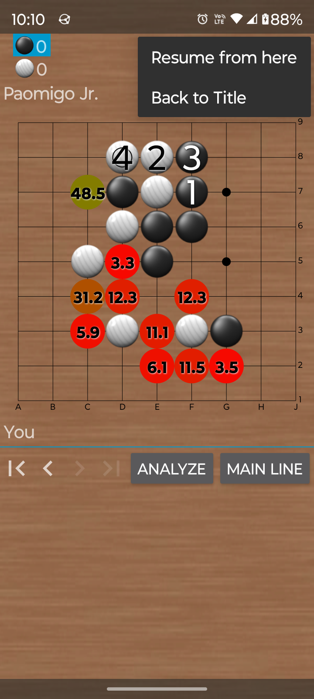
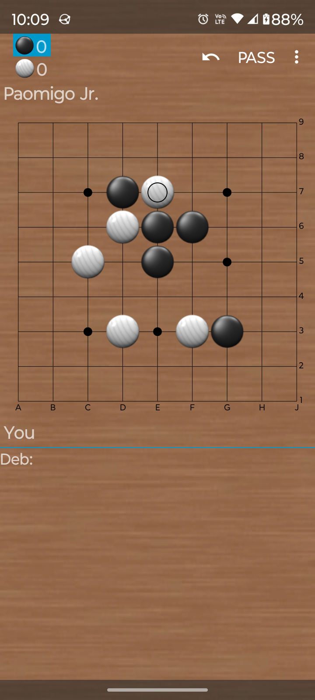
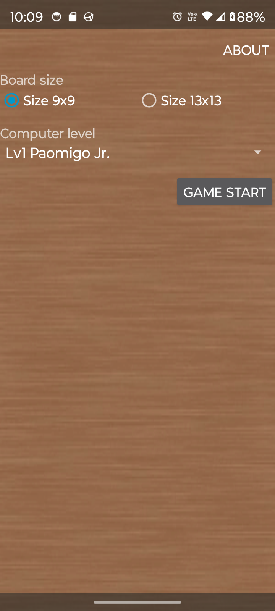

This is a modified version of [PaooGo](https://github.com/karino2/PaooGo), adapted for KataGo's human-like model ([discussion](https://github.com/karino2/PaooGo/issues/4)). On my phone, it plays at 2 sec/move on 9x9 and 3 sec/move on 13x13. Fast enough for me.

### Try it

1. Click "Fork".
2. In your fork, run "Actions > Build Debug APK".
3. Wait about 10 minutes (ignore the many warnings during KataGo compilation).
4. Download the generated debug APK from the workflow artifacts.

The APK is over 100 MB because it includes KataGo's model files ([b18-human](https://katagotraining.org/extra_networks/) + [b10](https://katagoarchive.org/g170/neuralnets/index.html)). On older phones, KataGo may take more than 20 seconds to start, but it runs fine once launched.

### Changes

- New AI player: Paokata (20k-9d)
- UI updates: Lizzie-compatible color scheme, long press for longer analysis or to skip 10 moves, etc.

### Acknowledgements

Thanks to the original authors and contributors of [PaooGo](https://github.com/karino2/PaooGo) and [Gobandroid](https://github.com/ligi/gobandroid) for making their source code available.

# PaooGo

Android igo app for primer, forked from [gobandroid](https://github.com/ligi/gobandroid).

## Screenshot

## Used engine

- [karino2/GnuGo2Fork](https://github.com/karino2/GnuGo2Fork)
- [karino2/Ray android_fork](https://github.com/karino2/Ray/tree/android_fork)
- [karino2/LibertyFork](https://github.com/karino2/LibertyFork)
- [karino2/KataGo: android_fork](https://github.com/karino2/KataGo)
- [karino2/AmigoGtpFork](https://github.com/karino2/AmigoGtpFork)
- [karino2/gnugo_fork: android_fork](https://github.com/karino2/gnugo_fork)
